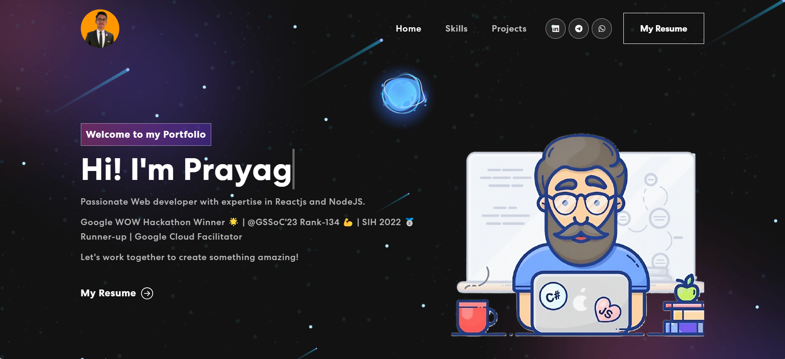
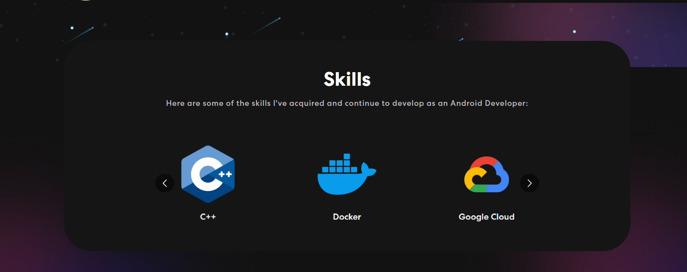
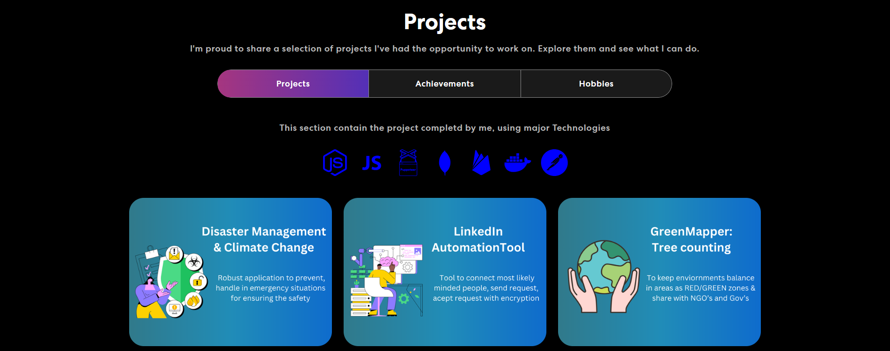
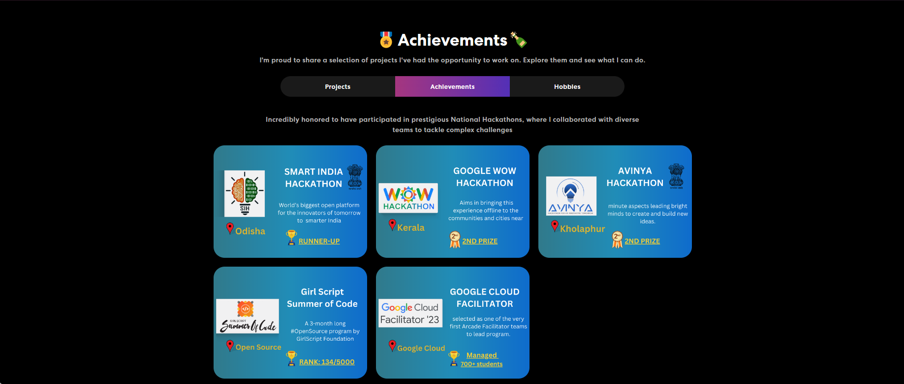
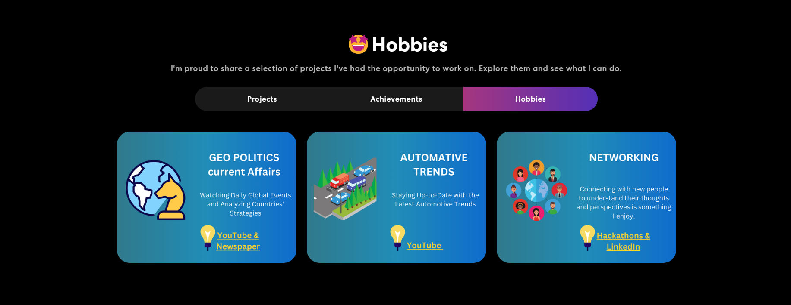

### Heya I'm Prayag Bhosale👋  

 <!--  -->

<!--
**Mrprayag077/Mrprayag077** is a ✨ _special_ ✨ repository because its `README.md` (this file) appears on your GitHub profile.

# 🌟 Welcome to my portfolio!🌟 <a href="https://mrprayag-portfolio-2d915.web.app/">view</a>

Here are some ideas to get you started:

- 🔭 I’m currently working on ...
- 🌱 I’m currently learning ...
- 👯 I’m looking to collaborate on ...
- 🤔 I’m looking for help with ...
- 💬 Ask me about ...
- 📫 How to reach me: ...
- 😄 Pronouns: ...
- ⚡ Fun fact: ...
-->

### 🌟 Welcome to my portfolio!🌟  <a href="https://mrprayag-portfolio-2d915.web.app/" target="_blank">[view]</a>
<!--  
 
  -->

- 🔭 I’m currently working on Web Development Technologies;
- 🌱 I’m currently learning Node.js, React;
- 🤔 I’m looking for help with Web Development skills;
- 💬 Ask me about Web development or any tech related stuff;
- 😄 Pronouns: Coder, Leader and Optimism;
- ⚡ Fun fact: Most of the Readers Simply Scan the Website;
- 📫 How to reach me: prayagbhosale800822@gmail.com

**Languages and Tools:**  
<code></code>
<code></code>
<code></code>
<code></code>
<code></code>
<code></code>
<code></code>

 

